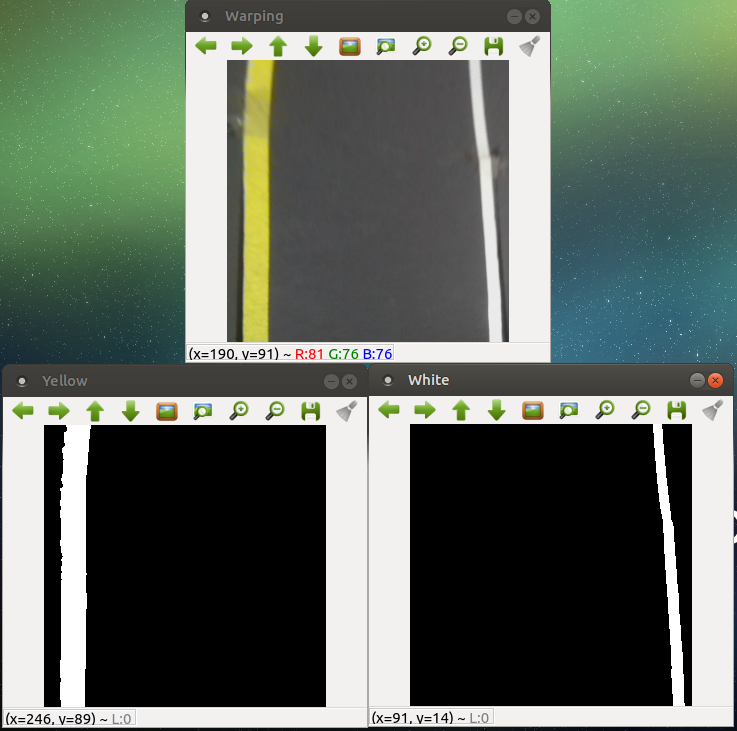
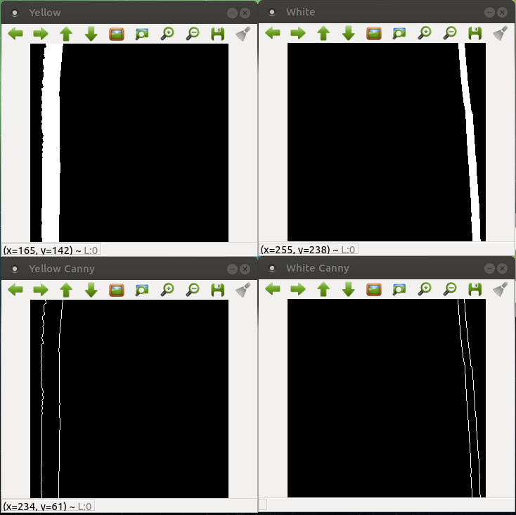
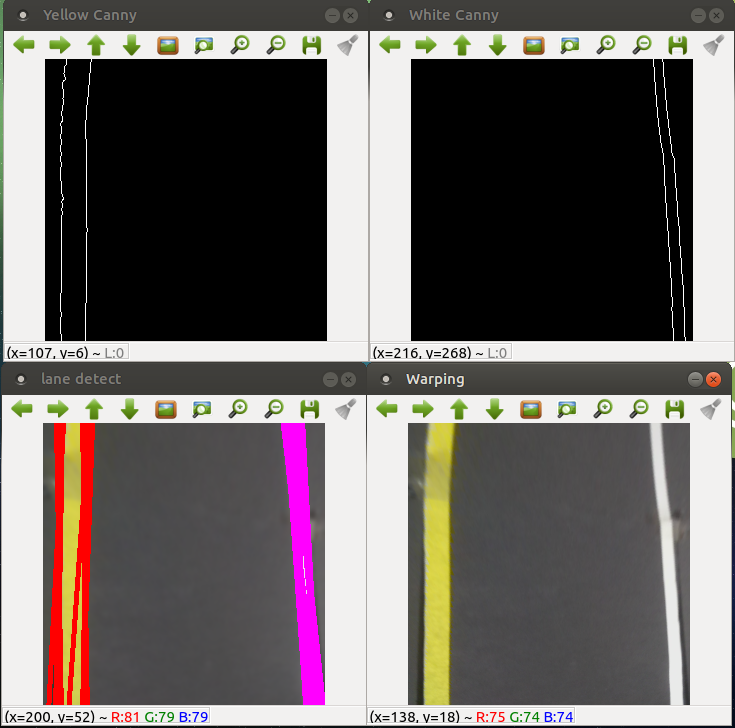

# Ajou Univ Capstone-Design. Lane Keeping and Obstacle Reaction

## Video
---

 

## Member Roles
---
| 이름         | 담당                  |
| ------------ | :-------------------- |
| 고세람       | 차선인식, 장애물 회피|
| 한관희       | 차선인식, PID값 최적화 |

## Goal
---
- 차선을 벗어나지 않고 직진과 곡선 차선 주행
- 장애물 접근 시 서행 후 정지 및 회피

## Environment
---
- Ubuntu mate 16.04
- ROS Melodic
- Rasberry Pi 3B+

## Structure
---
~~~
Univ-Capstone-Design
  └─ motor_pub
  │    └─ src
  │         └─ motor_pub.cpp      # Project main code
  └─ arduino_f.ino                 # arduino file
~~~

## Usage
---
~~~bash
$ rosrun motor_pub motor_pub
~~~

## Procedure
---
### lane keeping
1. ROI & Warping & Color Detection  
  
2. Canny Edge Detection  
  
3. HoughLines 함수로 차선 후보 검출  
  
4. 차선 후보 중 가장 왼쪽 후보와 가장 오른쪽 후보의 x좌표값들의 평균을 각각 계산
5. 두 값의 평균과 이미지 중심 점과의 차이를 구해서 error 도출
6. PID 제어

### obstacle reaction
1. 초음파 센서를 통해 전방의 물체와의 거리 계산
2. 물체와의 거리가 70cm~100cm 인 경우, P제어를 통한 감속
3. 물체와의 거리가 70cm 이하인 경우, 회피
